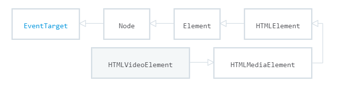
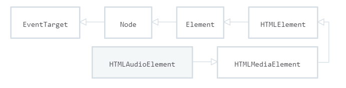
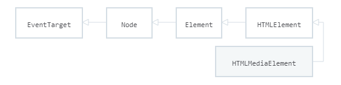

# `HTML5`新特性 -- `Unit01`

# 1.视频与音频

## 1.1 视频格式

浏览器支持的视频格式有：`MP4`、`WebM`、`OGG`

| 浏览器              | `MP4` | `WebM` | `OGG` |
| ------------------- | ----- | ------ | ----- |
| `Internet Explorer` | `Yes` | `NO`   | `NO`  |
| `Chrome`            | `Yes` | `Yes`  | `Yes` |
| `Firefox`           | `NO`  | `Yes`  | `Yes` |
| `Safari`            | `Yes` | `NO`   | `NO`  |
| `Opera`             | `NO`  | `Yes`  | `Yes` |

## 1.2 视频标签

### · 简写方式

```html

<video src="视频URL地址" width="宽度" height="高度">
    视频格式不支持时的提示文本
</video>

```

 示例代码如下：

```html

<video src="video/oceans.mp4"  width="960" height="400">
      <p>对不起，您的浏览器版本过低，<a href="https://www.google.cn/chrome/">单击</a>>此处下载最新版浏览器</p>
</video>

```

### · 标准方式

```html

<video width="宽度" height="高度">
    <source src="视频文件URL地址" type="视频文件MIME类型"/>
    <source src="视频文件URL地址" type="视频文件MIME类型"/>
    ...
    视频格式不支持时的提示文本
</video>

```

> `mp4`文件的`MIME`类型为：`video/mp4`
>
> `webm`文件的`MIME`类型为：`video/webm`
>
> `ogg`文件的`MIME`类型为：`video/ogg`

示例代码如下：

```html

<video width="960" height="540">
      <source src="video/flower.mp4" type="video/mp4"/>
      <source src="video/flower.webm" type="video/webm"/>
 </video>

```

## 1.3 视频属性

· `autoplay`，布尔属性，控制视频是否自动播放（需与`muted`属性组合使用）

· `muted`，布尔属性，控制视频是否静音播放

· `loop`，布尔属性，控制视频是否循环播放

· `controls`，布尔属性，控制是否显示视频控件

· `poster`，设置视频海报帧的`URL`

· `preload`，设置视频的预载入的处理方式

​    ·  `none` ，不缓存视频，为减少不必要的网络流量

​    ·  `metadata`，只加载视频的时长、宽度、高度等原始数据信息

​    ·  `auto`，默认值，浏览器会尽可能的下载视频文件

示例代码如下：

```html

 <video 
	src="video/oceans.mp4" 
    width="960" 
    height="400" 
    muted 
    loop 
    controls
    poster="ad/poster.jpg"
    preload="auto">
 </video>

```

## 1.4 音频格式

浏览器支持的音频格式：`mp3`、`wav`、`ogg`

| 浏览器              | `MP3` | `WAV` | `OGG` |
| ------------------- | ----- | ----- | ----- |
| `Internet Explorer` | `Yes` | `NO`  | `NO`  |
| `Chrome`            | `Yes` | `Yes` | `Yes` |
| `Firefox`           | `NO`  | `Yes` | `Yes` |
| `Safari`            | `Yes` | `YES` | `NO`  |
| `Opera`             | `NO`  | `Yes` | `Yes` |

## 1.5 音频标签

### ·  简写方式

```html

<audio src="音频文件URL地址">
    音频格式不支持时的提示文本
</audio>

```

示例代码如下：

```html

<audio src="audio/bad.mp3" controls>
</audio>

```

### · 标准方式

```html

<audio>
    <source src="音频文件URL地址" type="音频文件MIME类型"/>
    <source src="音频文件URL地址" type="音频文件MIME类型"/>
    ...
</audio>

```

> `mp3`文件`MIME`类型是：`audio/mp3`
>
> `wav`文件`MIME`类型是：`audio/wav`
>
> `ogg`文件`MIME`类型是：`audio/ogg`

## 1.6 音频属性

· `autoplay`，布尔属性，控制音频是否自动播放（需与`muted`属性组合使用）

· `muted`，布尔属性，控制音频是否静音播放

· `loop`，布尔属性，控制音频是否循环播放

· `controls`，布尔属性，控制是否显示音频控件

· `preload`，设置音频的预载入的处理方式

​    ·  `none` ，不缓存音频，为减少不必要的网络流量

​    ·  `metadata`，只加载音频的时长等原始数据信息

​    ·  `auto`，默认值，浏览器会尽可能的下载音频文件

# 2.`HTMLVideoElement`接口

`HTMLVideoElement`接口提供用于操纵视频对象的属性和方法

`HTMLVideoElement`接口继承自`HTMLMediaElement`接口



示例代码如下：

```html

<script>
    let videoEle = document.getElementById('video');
    window.alert(videoEle);
</script>

```

## 2.1 属性

### · `width`

`width`属性用于获取/设置视频元素的宽度，其语法结构是：

```javascript

//设置 
HTMLVideoElement.width = value

//获取
variable = HTMLVideoElement.width

```

> 在获取操作时必须保证`<video>`元素设置了`width`属性

### · `height`

`height`属性用于获取/设置视频元素的高度，其语法结构是：

```javascript

//设置 
HTMLVideoElement.height = value

//获取
variable = HTMLVideoElement.height

```

> 在获取操作时必须保证`<video>`元素设置了`height`属性

示例代码如下：

```html

<script>
    //获取HTMLVideoElement对象
    let videoEle = document.getElementById('video');
    //设置视频对象的宽度和高度
    videoEle.width = 480;
    videoEle.height = 200;
    //获取视频对象的宽度和高度
    console.log(videoEle.width);
    console.log(videoEle.height);
</script>
```

### · `videoWidth`

`videoWidth`属性用于获取视频对象的实际宽度，其语法结构是：

```javascript

variable = HTMLVideoElement.videoWidth

```

### · `videoHeight`

`videoHeight`属性用于获取视频对象的实际高度，其语法结构是：

```javascript

variable = HTMLVideoElement.videoHeight

```

示例代码如下：

```javascript

<script>
    //获取HTMLVideoElement对象
    let videoEle = document.getElementById('video');   
    //获取视频对象的实际宽度和实际高度 -- 已加载视频的第一帧数据
    videoEle.addEventListener('loadeddata',()=>{
        console.log(videoEle.videoWidth);
        console.log(videoEle.videoHeight);
    });
</script>

```

### · `poster`

`poster`用于获取/设置海报帧的`URL`地址，其语法结构是：

```javascript

//设置
HTMLVideoElement.poster =  url

//获取
variable = HTMLVideoElement.poster

```

# 3.`HTMLAudioElement`接口

`HTMLAudioElement`接口提供用于操纵音频对象的属性和方法

`HTMLAudioElement`接口继承自`HTMLMediaElement`接口



## 3.1 构造函数

```javascript

HTMLAudioElement = new Audio([string URL])

```

示例代码如下：

```html

<script>
    //创建HTMLAudioElement对象
    let audioEle = new Audio('audio/stronger.mp3');
    //显示HTMLAudioElement的播放控件
    audioEle.controls = true;
    //将HTMLAudioElement对象追加到DOM树
    document.body.appendChild(audioEle);
</script>

```

# 4.`HTMLMediaElement`接口

`HTMLMediaElement`接口是`HTMLVideoElement`和`HTMLAudioElement`的父接口。



> `W3C DOM 4.01`规范 https://www.w3.org/TR/2018/WD-dom41-20180201/

## 4.1 属性

### · `autoplay`

`autoplay`属性用于获取/设置媒体对象是否自动播放(实践时与`muted`组件使用)，其语法结构是：

```javascript

//设置
HTMLMediaElement.autoplay = boolean 

//获取
variable = HTMLMediaElement.autoplay

```

### · `muted`

`muted`属性用于获取/设置媒体对象播放时是否静音播放，其语法结构是：

```javascript

//设置
HTMLMediaElement.muted = boolean 

//获取
variable = HTMLMediaElement.muted

```

### · `loop`

`loop`属性用于获取/设置媒体对象播放时是否循环播放，其语法结构是：

```javascript

//设置
HTMLMediaElement.loop = boolean 

//获取
variable = HTMLMediaElement.loop

```

### · `controls`

`controls`属性用于获取/设置是否显示媒体对象的播放控件，其语法结构是：

```javascript

//设置
HTMLMediaElement.controls = boolean 

//获取
variable = HTMLMediaElement.controls

```

### · `src`

`src`属性用于获取/设置媒体对象的`URL`地址，其语法结构是：

```javascript

//设置
HTMLMediaElement.src = string url

//获取
variable = HTMLMediaElement.src

```

### · `preload`

`preload`属性用于获取/设置媒体对象的预载入方式，其语法结构是：

```javascript

//设置
HTMLMediaElement.preload = "none|auto|metadata"

//获取
variable = HTMLMediaElement.preload

```

示例代码如下:

```html

<video id="video"></video>
<p><button onclick="setVideoAttribute()" >设置视频属性</button></p>
<script>
    function setVideoAttribute() {
        //获取HTMLVideoElement
        let videoEle = document.getElementById('video');
        //设置HTMLVideoElement的URL属性
        videoEle.src = 'video/oceans.mp4';
        //设置HTMLVideoElement的width、height属性
        videoEle.width = 480;
        videoEle.height = 200;
        //设置HTMLVideoElement的autoplay属性为true
        videoEle.autoplay = true;
        //设置HTMLVideoElement的muted属性为true
        videoEle.muted = true;
        //设置HTMLVideoElement的controls属性为true
        videoEle.controls = true;
    }
</script>

```

### · `volume`

`volume`属性用于获取/设置媒体对象的音量，其值为`0.0 ~ 1.0`，语法结构是：

```javascript

//设置
HTMLMediaElement.volume = float value

//获取
variable = HTMLMediaElement.volume

```

示例代码如下：

```html

<video id="video" src="video/video.mp4" width="640" height="360" controls></video>
<p><button onclick="incrementVolume()">增大音量</button></p>
<p><button onclick="decrementVolume()">减少音量</button></p>
<script>
    function incrementVolume(){
        let videoEle = document.getElementById('video');
        //增大音量
        videoEle.volume = Math.min(1,videoEle.volume + 0.1);
        console.log(videoEle.volume);
    }
    function decrementVolume(){
        let videoEle = document.getElementById('video');
        //减小音量
        videoEle.volume = Math.max(0,videoEle.volume - 0.1);
        console.log(videoEle.volume);
    }
</script>

```

### · `playbackRate`

`playbackRate`属性用于获取/设置媒体对象的播放速度，正常播放速度为`1.0`； 小于`1.0`则比正常速度慢，大于`1.0`则比正常速度快，语法结构是：

```javascript

//设置
HTMLMediaElement.playbackRate = float

//获取
variable = HTMLMediaElement.playbackRate

```

> `0.0`是一个无效值

示例代码如下：

```html

<video id="video" src="video/video.mp4" width="640" height="360" controls></video>
<p><button onclick="changePlaybackRate('0.5')">0.5倍速</button></p>
<p><button onclick="changePlaybackRate('1.0')">1.0倍速</button></p>
<p><button onclick="changePlaybackRate('1.5')">1.5倍速</button></p>
<p><button onclick="changePlaybackRate('2.0')">2.0倍速</button></p>
<script>
    function changePlaybackRate(value){
        let videoEle = document.getElementById('video');
        //设置HTMLMediaElement对象的播放速度
        videoEle.playbackRate = value;
    }
</script>

```

### · `currentTime`

`currentTime`属性用于获取/设置媒体对象的当前播放时间，单位为秒，其语法结构是：

```javascript

//设置
HTMLMediaElement.currentTime = float

//获取
variable = HTMLMediaElement.currentTime

```

> 如果期望实时获取媒体播放时间，需要在`timeupdate`事件内调用`currentTime`属性

示例代码如下：

```html

<video id="video" src="video/video.mp4" width="640" height="360" controls></video>
<p><button onclick="changeCurrentTime('10')">前进10秒</button></p>
<p><button onclick="changeCurrentTime('-10')">后退10秒</button></p>
<script>
    function changeCurrentTime(value){
        let videoEle = document.getElementById('video');
        //设置HTMLMediaElement对象的当前的播放时间
        videoEle.currentTime += parseInt(value);
    }
</script>

```

### · `duration`

`duration` 属性用于获取媒体的总时长，单位为秒，其语法结构是：

```javascript

variable = HTMLMediaElement.duration

```

> A.如果媒体不可用，则返回值为`0`
>
> B.如果媒体可用，但时间长度未知，则返回`NaN`
>
> 一般情况下总时长的获取需要在`loadedata`事件内完成

示例代码如下：

```javascript

//在媒体对象的第一帧加载完毕后
videoEle.addEventListener('loadeddata', () => {
    //获取当前播放时间
    let current = parseInt(videoEle.currentTime);
    //获取总时长
    let duration = parseInt(videoEle.duration);
    //改变当前播放时间及总时长信息
    document.getElementById('current').innerText = current;
    document.getElementById('duration').innerText = duration;
});


```

### · `paused`

`paused`属性用于获取媒体对象是否正在暂停，其语法结构是：

```javascript

variable = HTMLMediaElement.paused

```

### ·  `ended`

`ended`属性用于获取媒体是否播放完毕，其语法结构是：

```javascript

variable = HTMLMediaElement.ended

```

## 4.2 方法

### · `play()`

`play()`方法用于实现媒体的播放，其语法结构是：

```javascript

HTMLMediaElement.play()

```

### · `pause()`

`pause()`方法用于实现媒体的暂停，其语法结构是：

```javascript

HTMLMediaElement.pause()

```

示例代码如下：

```html

<div id="container">
    <video id="video" src="video/video.mp4" width="640" height="360"></video>
    <p><button onclick="toggleControl()">播放/暂停</button></p>
</div>
<script>
    function toggleControl() {
        let videoEle = document.getElementById('video');
        if (videoEle.paused || videoEle.ended) {
            videoEle.play();
        } else {
            videoEle.pause();
        }
    }
</script>


```

## 4.3 事件

### · `loadeddata`

`loadeddata`事件在媒体对象的第一帧数据加载完毕后触发，其语法结构是：

```javascript

HTMLMediaElement.addEventListener('loadeddata',()=>{
	...
});

HTMLMediaElement.onloadeddata = ()=>{
    ....
};

```


### · `timeupdate`

`timeupdate`事件在媒体对象的`currentTime`属性发生变化时触发，其语法结构是：

```javascript

HTMLMediaElement.addEventListener('timeupdate',()=>{
	...
});

HTMLMediaElement.ontimeupdate = ()=>{
    ....
};

```

示例代码如下：

```javascript

//在媒体对象的currentTime属性发生变化时 -- 实时获取
videoEle.ontimeupdate = () => {
    //获取当前播放时间
    let current = parseInt(videoEle.currentTime);
    //改变当前播放时间
    document.getElementById('current').innerText = current;
}

```

### ·  `play`

`play`事件在媒体播放时触发，其语法结构是：

```javascript


HTMLMediaElement.addEventListener('play',()=>{
	...
});

HTMLMediaElement.onplay = ()=>{
    ....
};

```

### ·  `pause`

`pause`事件在媒体对象暂停时触发，其语法结构是：

```javascript

HTMLMediaElement.addEventListener('pause',()=>{
	...
});

HTMLMediaElement.onpause = ()=>{
    ....
};

```

示例代码如下：

```javascript

//当媒体对象播放时
videoEle.onplay = () => {
    let adEle = document.getElementById('ad');
    adEle.style.display = 'none';
}

//当媒体对象暂停时
videoEle.onpause = () => {
    let adEle = document.getElementById('ad');
    let adImageEle = document.getElementById('ad-image');
    adImageEle.src = 'ad/' + adLists[Math.floor(Math.random() * adLists.length)];
    adEle.style.display = 'block';
}

```

### · `ended`

`ended`事件在媒体对象播放结束时触发，其语法结构是：

```javascript

HTMLMediaElement.addEventListener('ended',()=>{
	...
});

HTMLMediaElement.onended = ()=>{
    ....
};

```

示例代码如下：

```javascript

//当媒体对象播放结束时
videoEle.onended = () => {
    window.setTimeout(() => {
    	location.href = 'http://www.baidu.com';
    }, 5000);
};

```

