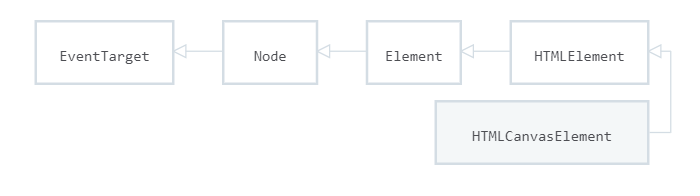

# `HTML5`新特性 -- `Unit02`

# 1.全屏`API`

全屏`API`用于控制某个`HTML Element`占满整个屏幕。

## • 进入全屏模式

```javascript

//W3C建议
HTMLElement.requestFullscreen()

//Chrome、safari、Opera浏览器
HTMLElement.webkitRequestFullScreen()

//Firefox
HTMLElement.mozRequestFullScreen()

//Internet Explorer/Edge
HTMLElement.msRequestFullscreen()

```

兼容浏览器的写法：

```javascript

function enterFullscreen(element){
	if(element.requestFullscreen){
    	element.requestFullscreen()
    } else if(element.webkitRequestFullScreen){
        element.webkitRequestFullScreen()
    } else if(element.mozRequestFullScreen){
        element.mozRequestFullScreen();
    } else if(element.msRequestFullscreen){
        element.msRequestFullscreen();
    }
}

```

## • 退出全屏模式

```javascript

//W3C建议
document.exitFullscreen()

//Chrome、safari、Opera
document.webkitExitFullScreen()

//Firefix
document.mozCancelFullScreen()

//Internet Explorer/Edge
document.msExitFullscreen()

```

兼容浏览器的写法：

```javascript

function exitFullscreen(){
    if(document.exitFullscreen){
		document.exitFullscreen();
    } else if(document.webkitExitFullScreen){
		document.webkitExitFullScreen();
    } else if(document.mozCancelFullScreen){
        document.mozCancelFullScreen();
    } else if(document.msExitFullscreen){
        document.msExitFullscreen();        
    }
}
```

## • `document.fullscreenElement`属性

`document.fullscreenElement`属性用于获取正处于全屏状态的`HTML`元素，如果当前没有`HTML`

元素处于全屏状态，则返回 `NULL`，其语法结构是：

```javascript

//W3C建议
document.fullscreenElement
//Chrome、Safari、Opera
document.webkitFullScreenElement
//Firefox
document.mozFullScreenElement
//Internet Explorer/Edge
document.msFullscreenElement

```

兼容浏览器的写法：

```javascript

function getFullscreenElement(){
	return  document.fullscreenElement ||
        	document.webkitFullScreenElement ||
        	document.mozFullScreenElement ||
        	document.msFullscreenElement;
}

```

# 2.`Canvas`

## 2.1 什么是`Canvas`?

`Canvas`是可以使用`JavaScript`来绘制图形的`HTML`元素

`Canvas`元素的语法结构是：

```html

<canvas width="宽度" height="高度">

</canvas>

```

> `<canvas>`元素默认的尺寸为`300X150`

示例代码如下：

```html

<canvas width="800" height="480">
</canvas>

```

## 2.2 `Canvas`有什么用?

• 数据可视化，如百度`ECharts`(https://echarts.apache.org/zh/index.html)

• 游戏画面

• `Banner`广告

## 2.3 坐标

`<canvas>`元素的坐标原点`0,0`位于画布的左上角

## 2.4 `HTMLCanvasElement`接口

`HTMLCanvasElement`接口提供用于操纵`<canvas>`元素的属性和方法

`HTMLCanvasElement`接口继承自`HTMLElement`接口



示例代码如下：

```html

<canvas width="800" height="480" id="canvas">
</canvas>
<script>
    let canvasEle = document.getElementById('canvas');
    window.alert(canvasEle);
</script>

```

### 2.4.1 属性

#### • `width`

`width`属性用于获取/设置`<canvas>`元素的宽度，语法结构是：

```javascript

//设置
HTMLCanvasElement.width = number

//获取
variable = HTMLCanvasElement.width

```

#### • `height`

`height`属性用于获取/设置`<canvas>`元素的高度，语法结构是：

```javascript

//设置
HTMLCanvasElement.height = number

//获取
variable = HTMLCanvasElement.height

```

示例代码如下：

```html

<canvas id="canvas">
</canvas>
<script>
    let canvasEle = document.getElementById('canvas');
    //设置canva的宽度和高度
    canvasEle.width = 600;
    canvasEle.height = 400;
    //输出canva的宽度和高度
    console.log(canvasEle.width);
    console.log(canvasEle.height);
</script>

```

### 2.4.2 方法

#### • `getContext`

`getContext()`方法用于返回`canvas`的上下文，如果上下文没有定义则返回`null`，其语法结构是：

```javascript

HTMLCanvasElement.getContext(string contextType)

```

> 上下文的取值有：
>
> `2d`，此时将创建一个`CanvasRenderingContext2D`的二维渲染上下文对象
>
> `webgl`，此时将创建一个`WebGLRenderingContext`的三维渲染上下文对象

示例代码如下：

```html

<canvas id="canvas">
</canvas>
<script>
    //获取HTMLCanvasElement对象
    let canvasEle = document.getElementById('canvas');
    let ctx = canvasEle.getContext('2d');
    window.alert(ctx);
</script>

```

# 3.`CanvasRenderingContext2D`接口

## 3.1 绘制矩形

### • `strokeRect()`方法

`strokeRect()`方法用于绘制矩形框，其语法结构是：

```javascript

CanvasRenderingContext2D.strokeRect(x,y,width,height)

```

> 该方法直接绘制到画布而不是修改当前路径，所以后续`storke()`及`fill()`方法对它没有影响

### • `fillRect()`方法

`fillRect()`方法用于绘制填充矩形，其语法结构是：

```javascript

CanvasRenderingContext2D.fillRect(x,y,width,height)

```

示例代码如下：

```html

<script>
    //获取HTMLCanvasElement对象
    let canvasEle = document.getElementById('canvas');
    //获取CanvasRenderingContext2D对象
    let ctx = canvasEle.getContext('2d');
    //绘制矩形框
    ctx.strokeRect(200,200,100,150);
    //绘制填充矩形
    ctx.fillRect(350,200,100,150);
</script>

```

## 3.2 描边和填充样式

### • `strokeStyle`属性

`strokeStyle`用于设置/获取描边颜色，其语法结构是：

```javascript

//设置
CanvasRenderingContext2D.strokeStyle = string color

//获取
variable = CanvasRenderingContext2D.strokeStyle

```

### •  `fillStyle`属性

`fillStyle`用于设置/获取填充颜色，其语法结构是：

```javascript

//设置
CanvasRenderingContext2D.fillStyle = string color

//获取
variable = CanvasRenderingContext2D.fillStyle

```

示例代码如下：

```html

<canvas id="canvas" width="600" height="400">
</canvas>
<script>
    //获取HTMLCanvasElement对象
    let canvasEle = document.getElementById('canvas');
    //获取CanvasRenderingContext2D对象
    let ctx = canvasEle.getContext('2d');
    //设置描边颜色
    ctx.strokeStyle = 'red';
    //绘制矩形框
    ctx.strokeRect(200,200,100,150);
    //设置填充颜色
    ctx.fillStyle = '#f00';
    //绘制填充矩形
    ctx.fillRect(350,200,100,150);
    //设置填充颜色
    ctx.fillStyle = 'rgba(0,0,0,1)';
    //绘制填充矩形
    ctx.fillRect(200,50,250,100);
</script>

```

## 3.3 绘制文本

### •  `strokeText()`方法

`strokeText()`方法用于绘制描边文本，其语法结构是：

```javascript

CanvasRenderingContext2D.strokeText(text,x,y)

```

### • `fillText()` 方法

`fillText()`方法用于绘制填充文本，其语法结构是：

```javascript

CanvasRenderingContext2D.fillText(text,x,y)

```

### • `font`属性

`font` 属性用于设置/获取文本的样式，语法结构是：

```javascript

//设置
CanvasRenderingContext2D.font = "字号 字体"

//获取
variable = CanvasRenderingContext2D.font

```

作业：绘制柱形图（柱图形在画布范围间距均分）