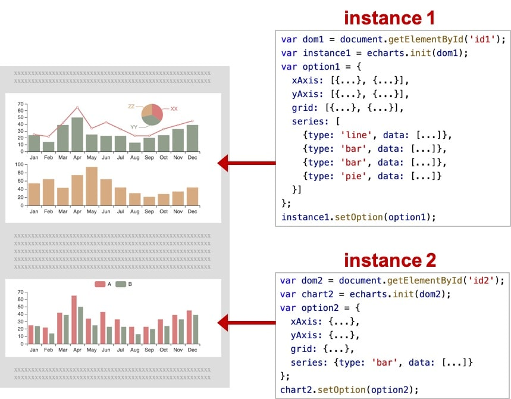

# `HTML5`新特性 -- `Unit08`

# 1.`SVG`

## 1.1 什么是`SVG`?

`SVG(Scalable Vector Graphic)`，可缩放的矢量图形，是基于`XML`语法的`2D`的矢量图形格式。

`SVG`的标准由`W3C`来制定和维护(https://www.w3.org/Graphics/SVG/)。

## 1.2 `SVG`与`Canvas`的区别

|          | SVG                                      | Canvas                   |
| -------- | ---------------------------------------- | ------------------------ |
| 分辨率   | 矢量图形，不依赖于分辨率                 | 位图图形，依赖于分辨率   |
| 事件处理 | 支持事件处理                             | 不支持单一对象的事件处理 |
| 应用方向 | 主要带有大型渲染区域的内容，如地图、图表 | 适用于网页动画、游戏等   |

## 1.3 `SVG`的使用方式

### • ``标签

```html


```

示例代码如下：

```html

<div id="header">
    
</div>

```

### • `CSS`中的`background-image` 属性

```css

selector{
	background-image:url(SVG文件的URL地址);
}

```

示例代码如下：

```html

<style>
    body{
        background: url(svg/background.svg);
        background-size: cover;
    }
</style>

```

### • `object`标签

```html

<object data="URL地址" type="MIME类型">
    浏览器不支持该类型的文件时显示的提示信息
</object>

```

> `SVG`文件的`MIME`类型为`image/svg+xml`

### • `<embed>`标签

```html

<embed src="URL地址" type="MIME类型" width="宽度" height="高度">
	浏览器不支持该类型的文件时显示的提示信息
</embed>

```

> `SVG`文件的`MIME`类型为`image/svg+xml`

示例代码如下：

```html

<embed src="svg/lowdetail.svg" type="image/svg+xml" width="223" height="300">
</embed>

```

### • `<iframe>`标签

```html

<iframe src="URL地址" width="宽度" height="高度">
</iframe>

```

示例代码如下：

```html

 <iframe 
         src="svg/iframe.svg" 
         width="400" 
         height="300"
         scrolling="no"
         frameborder="0">
</iframe>

```

### • `<svg>`标签

```html

<svg version="1.1" xmlns="http://www.w3.org/2000/svg">
    ...
</svg>

```

> `XMLNS(XML Namespace)`，译为`XML`命名空间，命名空间用于解决标记名称冲突

示例代码如下：

```html

<svg 
     width="200" 
     height="200" 
     version="1.1"
     xmlns="http://www.w3.org/2000/svg">
    <text x="50" y="50" font-size="50">SVG</text>
</svg>

```

## 1.4 `SVG`元素

### • 元素属性

• `stroke`属性用于控制描边的颜色

• `stroke-width`属性用于控制描边的宽度

### • `<line>`元素

`<line>`元素用于绘制线段，语法结构是：

```html

<line x1="start_x" y1="start_y" x2="end_x" y2="end_y"></line>

```

示例代码如下：

```html

<svg class="svg" version="1.1" xmlns="http://www.w3.org/2000/svg"  stroke-width="2" stroke="red">
    <line x1="50" y1="50" x2="150" y2="50"></line>
    <line x1="80" y1="80" x2="180" y2="80"></line>
    <line x1="50" y1="100" x2="150" y2="100"  stroke-width="5" stroke="blue">	</line>
</svg>

```

### • `<polyline>`元素

`<polyline>`元素用于绘制开放的折线，其语法结构是：

```html

<polyline points="x1,y1,x2,y2,...">
</polyline>

```

示例代码如下：

```html

<svg 
     class="svg" 
     stroke-width="2" 
     stroke="red" 
     xmlns="http://www.w3.org/2000/svg" version="1.1">
      <polyline points="40,270,100,200,130,240,300,100" fill="transparent"></polyline>
  </svg>

```

### • `<rect>`元素

`<rect>`元素用于绘制(圆角)矩形，其语法结构是：

```html

<rect 
      x="start_x" y="start_y" 
      width="宽度" height="高度" 
      rx="rx" ry="ry">
</rect>

```

示例代码如下：

```html

<svg version="1.1" xmlns="http://www.w3.org/2000/svg" id="svg">
    <rect  x="20" y="20" 
	    width="150" height="150"
    	fill="red">
  	</rect>
    <rect x="190" y="20" 
	    width="150" height="150"
    	stroke="red" stroke-width="1" 
        fill="transparent" rx="10" ry="10">
    </rect>


```


### • `<text>`元素

`<text>`元素用于绘制文本，语法结构是：

```html

<text x="start_x" y="start">...</text>

```

示例代码如下：

```html

<svg id="svg" version="1.1" xmlns="http://www.w3.org/2000/svg">
      <text 
        x="30" y="30" 
        font-size="35"
        font-family="隶书"
        fill="red">中华人民共和国万岁</text>
  </svg>

```

### • `<a>`元素

`<a>`元素用于实现链接，其语法结构：

```html

<a xlink:href="目标文档URL地址" target="窗口形式">...</a>

```

> 在使用`<a>`元素时，应该使用`xmlns:xlink="http://www.w3.org/1999/xlink"`命名空间

示例代码如下：

```html

<svg 
     id="svg" 
     version="1.1" 
     xmlns="http://www.w3.org/2000/svg"
     xmlns:xlink="http://www.w3.org/1999/xlink">
    <a xlink:href="http://www.baidu.com" target="_blank">
        <text 
              x="30" y="30" 
              font-size="35"
              font-family="隶书"
              fill="red">
            众里寻他千百度
        </text>
    </a>
</svg>

```

> `SVG`在线编辑器 -- https://c.runoob.com/more/svgeditor/
>
> `SVG`矢量绘制软件 -- `Illustrator`

## 1.5 `SVG DOM API`

`SVG DOM`是`XML DOM`的组成部分，也就意味着其无法使用`HTML DOM`的任何属性和方法。

`W3C DOM规范` https://www.w3.org/TR/DOM-Level-3-Core/

### • `createElementNS()`方法

`createElementNS()`方法用于创建指定命名间内的元素，其语法结构是：

```javascript

Element document.createElementNS('命名空间','元素名称')

```

### • `setAttribute()`方法

`setAttrbute()`方法用于设置元素的属性，其语法结构是：

```javascript

Element.setAttribute(name,value)

```

### • `getAttribute()`方法

`getAttribute()`方法用于获取元素的属性，其语法结构是：

```javascript

variable = Element.getAttribute(name)

```

### • 获取元素的方法

```javascript

document.getElementById(string id)
document.querySelector(string selector)
document.querySelectorAll(string selector)
document.getElementsByTagName(string tagName)

```

### • 增加/删除元素的方法

```javascript

Element.appendChild(subElement)
Element.removeChild(subElement)

```

# 2.`ECharts`

`ECharts`是百度开发的开源的数据可视化工具，是纯`JS`的图表库。https://echarts.apache.org/zh/index.html

## 2.1 下载

### • 浏览器下载

https://echarts.apache.org/zh/download.html

### • `NPM`

```shell

npm install --save echarts

```

## 2.2 图表术语

• 实例(`Instance`)

在一个网页中可以存在多个图表实例，每一个图表实例中均可存在多个图表（如柱形图、折线图等）.



•  系列(`series`)

系列是指每个实例中所绘制的图表，一个图表中至少存在一个系列。


• 组件(`component`)

一个图表由多个部分组成，每个部分称为组件(`component`)，如`X`轴，`Y`轴、图例等。


## 2.3 `ECharts`的使用步骤

A.在`HTML`页面中通过`<script>`标签引入外部的脚本文件

B.在`HTML`页面中准备一个`DIV`元素，其将作为`Charts`的渲染容器（必须为该`DIV`元素设置宽度及高度的`CSS`样式）

C.书写`<script>`标签，通过`echarts`对象的`init()`方法**创建图表实例**

> 当引入外部脚本文件后，将自动暴露名称为`echarts` 的对象
>
> 在`init()`方法中至少提供哪一个`HTML`元素作为渲染容器出现

D.通过**图表实例**的`setOption()`方法配置图表实例

> 图表实例的`setOption()`方法的语法结构是：
>
> ```javascript
> 
> instance.setOption({...})
> 
> ```

## 2.4 配置选项

## • `title`

`title`选项用于标题信息的配置，语法结构为：

```javascript

title:{
	text:"主标题文本",
	link:"主标题链接",
	target:"打开主标题链接的窗口形式(blank|self)",
	subtext:"副标题文本",
	sublink:"副标题链接",
	subtarget:"副开主标题链接的窗口形式(blank|self)",
    top:"标题组件距容器顶部的距离",
    right:"标题组件距容器右侧的距离",
	bottom:"标题组件距容器底部的距离",        
	left:"标题组件距容器左侧的距离"      
}


```

### • `xAxis`

`X`轴组件，其语法结构是：

```javascript

xAxis:{
	type:"X坐标轴的类型(category,类目轴)",
    data:[]
}

```

> `data`的数据类型为数组或数组对象，如：
>
> ```javascript
> 
> data:['语文','数学','英语']
> 
> ```
>
> ```javascript
> 
> data:[
> 	'语文',
>     {
>     	value:'数学',
>         textStyle:{
>             fontSize:24,
>             color:'#f00'
>         }
>     },
>     '英语'
> ]
> 
> ```
>
> 

### •  `yAxis`

`Y`轴组件，参见`X`轴

### • `series`

系列组件，其语法结构是：

```

series:[
	{
		type:"系列类型(line|bar|pie)",
		data:[]
	},
	...
]

```

