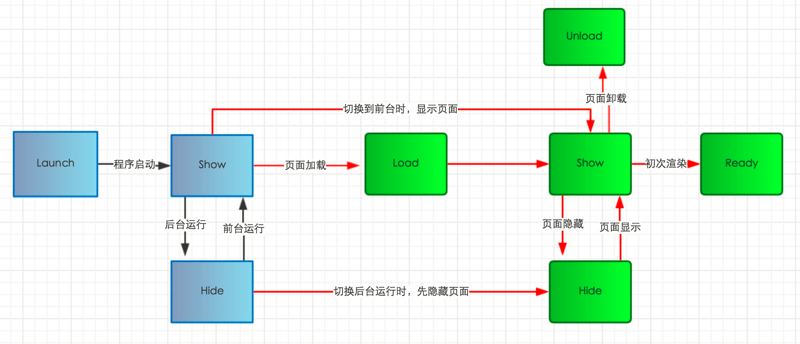

#  微信小程序  - `Unit3`

# 1.事件

事件是视图层到逻辑层的通讯方式。

事件可以绑定到组件上，当触发该事件后，就会执行逻辑层的事件处理函数。 

## 1.1 事件列表

|          | 浏览器事件                       | 移动端事件                                                   | 小程序事件                                                   |
| -------- | -------------------------------- | ------------------------------------------------------------ | ------------------------------------------------------------ |
| 键盘事件 | `keydown`、`keyup`、`keypress`   | 无                                                           | 无                                                           |
| 鼠标事件 | `click`、`mouseover`、`mouseout` | 无                                                           | 无                                                           |
| 页面事件 | `load`、`unload`                 | `load`、`unload`                                             | 生命周期的钩子函数                                           |
| 触屏事件 | 无                               | `touchstart`、<br />`touchmove`、<br />`touchend`、<br />`touchcancel`<br />`tap`，<br />`longtap` | `touchstart`、<br />`touchmove`、<br />`touchend`、<br />`touchcancel`<br />`tap`，<br />`longtap`<br />`longpress` |

> `touchstart`，开始触屏
>
> `touchmove`，触屏拖动
>
> `touchend`，释放手指
>
> `touchcancel`,触屏被取消（如来电话了）
>
> `tap`,轻敲
>
> `longtap`,长敲(`350ms`)
>
> `longtap`事件会触发`tap`事件
>
> `longpress`事件不会触发`tap`事件

`tap`、`longtap`及`longpress`的区别示例：

```html

<!--page.wxml-->

<view>
    <button type="primary" bindtap="f1" bindlongtap="f2">按钮</button>
    <button type="primary" bindtap="f1" bindlongpress="f3">按钮</button>
</view>

```

```javascript

//page.js

Page({
    f1(){
        console.log('button.tap');
    },

    f2(){
        console.log('button.longtap');
    },
    f3(){
        console.log('button.longpress');
    }
});

```

## 1.2 事件绑定

```html

<component bind事件名称="函数名称">...</component>

<component bind:事件名称="函数名称">...</component>

<component catch事件名称="函数名称">...</component>

```

> 事件触发的函数名称不能带有小括号！！！
>
> `catch`会阻止事件冒泡，而`bind`则不阻止事件冒泡

关于`catch`与`bind`的区别，示例代码如下：

```html

<!--page.wxml-->

<view style="margin:10px 0;border:2px solid #f00" bindtap="parenttap">
    <button bindtap="sontap">bind事件</button>
</view>


<view style="margin:10px 0;border:2px solid #00f" bindtap="parenttap">
    <button catchtap="soncatchtap">catch事件</button>
</view>

```

```javascript

//page.js

Page({
    sontap(){
        console.log('sontap');
    },

    parenttap(){
        console.log('parenttap');
    },

    soncatchtap(){
        console.log('soncatchtap');
    } 
});

```

## 1.3 事件对象 -- `Event`

微信小程序中事件绑定时的函数名称不能带有小括号，引发的问题是：如何进行参数的传递？ 

方法1：可以在组件上通过自定义属性`data-*`来实现

当通过自定义属性`data-*`进行参数传递时，在调用的函数中用`event.target.dataset.*`进行获取。

> 提示
>
> 多个单词的写法会自动转换成驼峰标记法，如：
>
> `<button data-cate-id="5">`将转换成为`cateId`
>
> 单词中包含大写字符的，将自动转换为小写字符，如：
>
> `<button data-USER-ID="5">`将转换为`userId`

方法2：对于微信小程序自定义事件(如`input`组件的`bindinput`事件)传递参数时，需要在事件函数中通过`event.detail.value`进行获取。

示例代码如下：

```html

<!--page.wxml-->
<view style="margin:10px 0;border:2px solid #000">
  <input type="text" bindinput="getInput"/>
</view>

```

```javascript

//page.js

Page({	
    getInput(e){
        console.log(e.detail.value);
    }
})

```

`Event`事件对象包含的属性有：

- `type`,事件类型，如`tap`、`longtap`、`longpress`等
- `target` ，触发事件的源组件，`object`类型 
  - `id` ,源组件的`ID`
  -  `dataset`，源组件上由`data-*`开头的自定义属性的集合，`object`类型
- `detail`,指自定义事件对象所携带的数据，如用户在输入框组件中输入的数据，`object`类型
  - `value`，指当前组件的值
  - `cursor`，当前光标的位置
  - `keyCode`，当前数据的`ASCII`码

## 1.4  双向数据绑定

`Model` -> `View` 

```html

{{variable}}

```

示例代码如下：

```html

<!--page.wxml-->

<view style="margin:10px 0;border:2px solid #f00">
    <input type="text"/>
    输入的信息为:<text>{{message}}</text>
</view>

```

```javascript

//page.js

Page({
    data:{
        message:''
    }
})

```

`View` -> `Model`

```javascript

this.setData({
	变量名称:值
    [,...]
})

```

示例代码如下：

```html

<!--page.wxml-->

<view style="margin:10px 0;border:2px solid #f00">
    <input type="text" bindinput="binding"/>
    输入的信息为:<text>{{message}}</text>
</view>

```

```javascript

//page.js

Page({
    binding(e){
        this.setData({
            message:e.detail.value
        })
    }    
})

```

# 2.微信小程序的生命周期

## 2.1 小程序应用的生命周期

小程序应用的生命周期 -- `app.js`

- `onLaunch`，在小程序初始化完成时触发，全局只触发一次

  ```javascript
  
  App({
  	onLaunch(){
  		...
  	}
  })
  
  ```

- `onShow `，小程序启动或从后台切换到前台显示时触发

  ```
  
  App({
  	onShow(){
  		...
  	}
  })
  
  ```

- `onHide`，小程序从前台切换到后台时隐藏时触发

  ```javascript
  
  App({
  	onHide(){
  		...
  	}
  })
  
  ```

## 2.2 小程序页面的生命周期

- `onLoad(options)`，页面加载时触发，一个页面只会触发一次

  ```javascript
  
  Page({
  	onLoad(options){
  		...
  	}
  })
  
  ```

  > `options`参数指所有`URL`参数形成的对象

- `onShow()`，页面显示/切换到前台时触发

  ```
  
  Page({
  	onShow(){
  		...
  	}
  })
  
  ```

- `onReady()`,页面初次渲染完成时触发，一个页面只会调用一次，代表页面已经准备完毕，可以与视图层进行交互

  ```
  
  Page({
  	onReady(){
  		...
  	}
  })
  
  ```

- `onHide()`,页面隐藏/切换到后台时触发

  ```javascript
  
  Page({
  	onHide(){
  		...
  	}
  })
  
  ```

- `onUnload()`,页面卸载时触发

  ```
  
  Page({
  	onUnload(){
  		...
  	}
  })
  
  ```

  > `tabBar`中的页面切换时不会触发`onunload`事件，因为每个选项卡页面一旦创建就常驻内存。